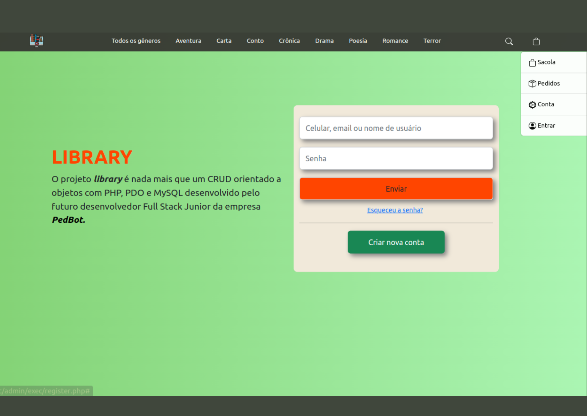
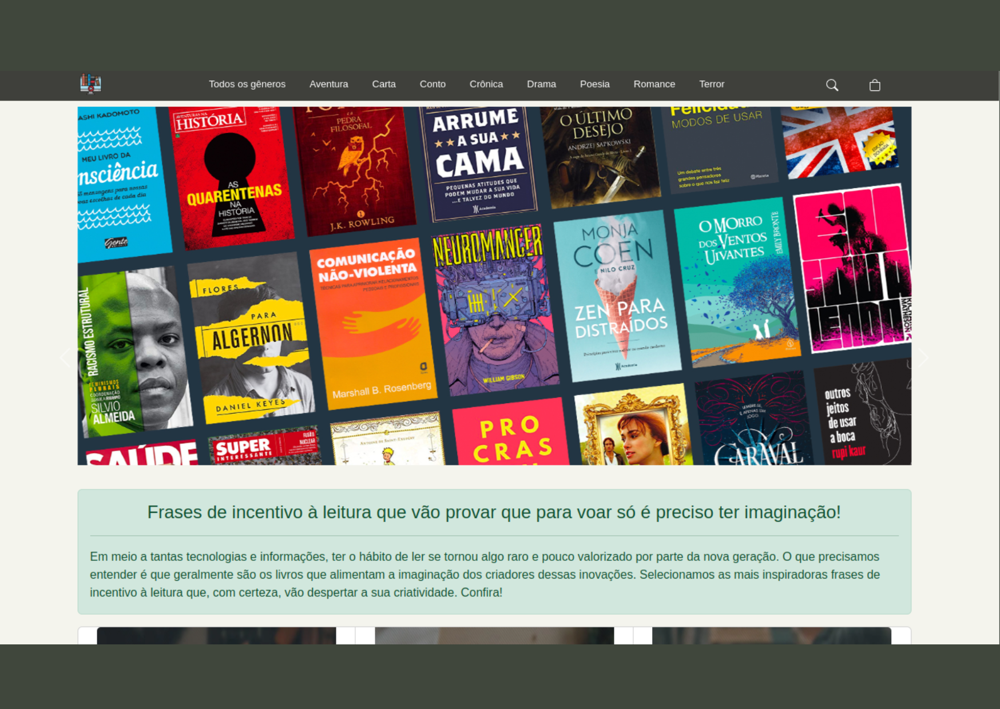

<h1 align="center"> CRUD Orientado a objetos com PDO, PHP e MySQL </h1>

## Resumo do projeto
_____

## Técnicas e tecnologias utilizadas

## 📁 Acesso ao projeto
Você pode acessar os arquivos do projeto clicando [aqui](https://github.com/Guils1/PHP-POO).

